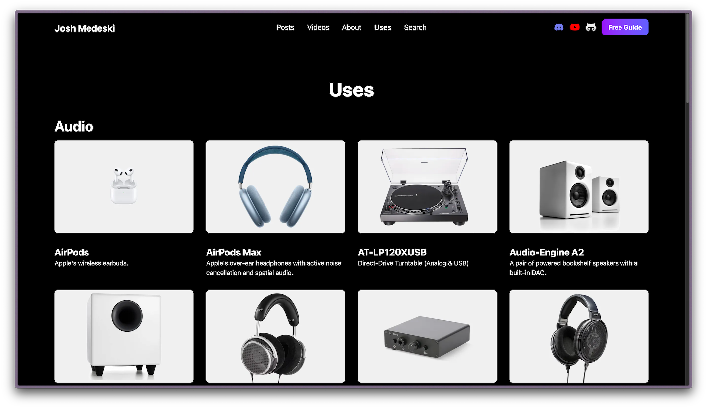

# Josh Medeski's Dotfiles


This is the home of all my dotfiles. These are files that add custom configurations to my computer and applications, primarily the terminal.

## How to install

My dotfiles are managed by [GNU Stow](https://www.gnu.org/software/stow/).

1. Install [homebrew](https://brew.sh/)
2. Install [GNU Stow](https://www.gnu.org/software/stow/) (`brew install stow`)
3. Clone this repository
4. Run stow command

```sh
stow . -t ~
```

## Software

- Terminal: [Wezterm](https://wezfurlong.org/wezterm)
- Font: [Maple Mono](https://github.com/subframe7536/maple-font)
- Colors: [catppuccin](https://github.com/catppuccin/catppuccin)
- Shell: [fish](https://fishshell.com)
- Multiplexer: [tmux](https://github.com/tmux/tmux/wiki)
  - Session manager: [sesh](https://github.com/joshmedeski/sesh)
- Editor: [Neovim](https://neovim.io)
- Git: [lazygit](https://github.com/jesseduffield/lazygit)
- npm package manager: [pnpm](https://pnpm.io/)
- macOS package manager: [Homebrew](https://brew.sh)

## Hardware and Keyboards

If you want to see what hardware, keyboards, and other peripherals I use, check out my [uses page](https://www.joshmedeski.com/uses/)



