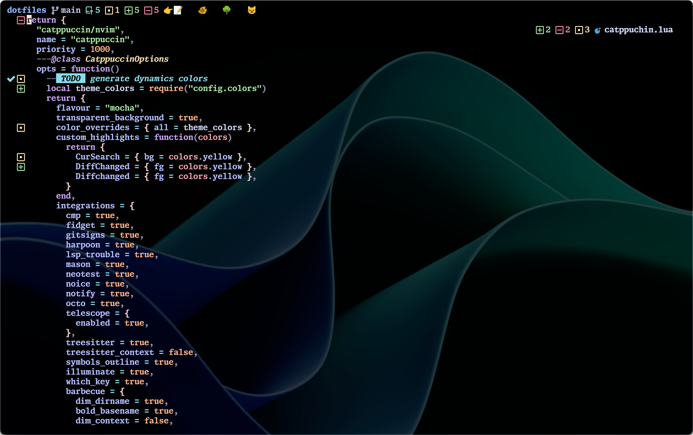

# Josh Medeski's Dotfiles

This is the home of all my dotfiles. These are files that add custom configurations to my computer and applications, primarily the terminal.

## Software

- Terminal: [Wezterm](https://wezfurlong.org/wezterm)
- Font: [Monaspace](https://monaspace.githubnext.com/)
- Colors: [catppuccin](https://github.com/catppuccin/catppuccin)
- Shell: [fish](https://fishshell.com)
- Multiplexer: [tmux](https://github.com/tmux/tmux/wiki)
- Editor: [Neovim](https://neovim.io)
- Git: [lazygit](https://github.com/jesseduffield/lazygit)
- macOS package manager: [Homebrew](https://brew.sh)
- npm package manager: [pnpm](https://pnpm.io/)

## Hardware

- Laptop: [MacBook Pro](https://www.apple.com/macbook-pro-14-and-16/) (16-inch, 2023, Apple M2 Max Chip, 32GB RAM)
- Mouse: Logitech trackball

## Keyboards

- [Zsa Moonlander](https://www.zsa.io/moonlander/)
- [NuPhy Air75 (v1)](https://nuphy.com/products/air75-v2)
- [IQUNIX L80 Cosmic Traveller](https://iqunix.store/collections/80-series/products/iqunix-l80-cosmic-traveller)
- [Zsa Ergodox EZ](https://ergodox-ez.com)
